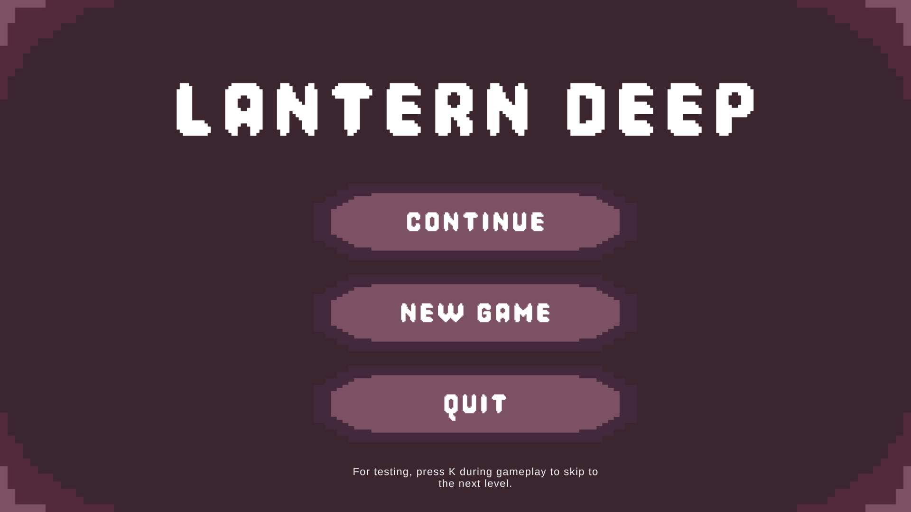
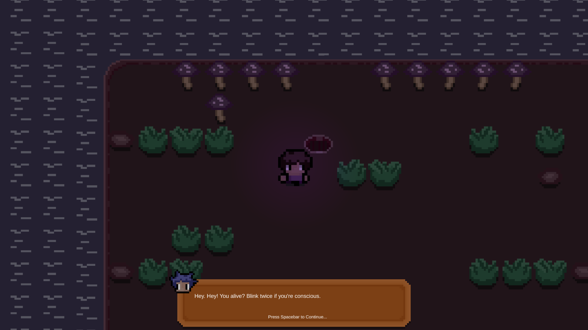
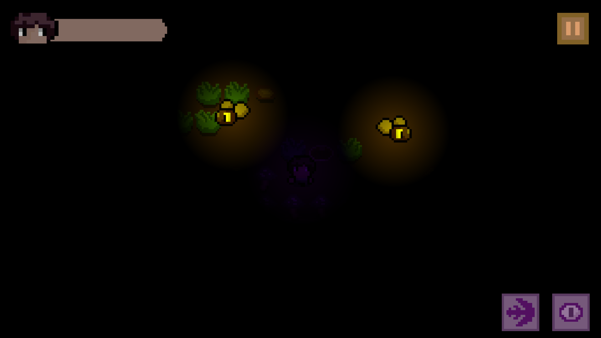
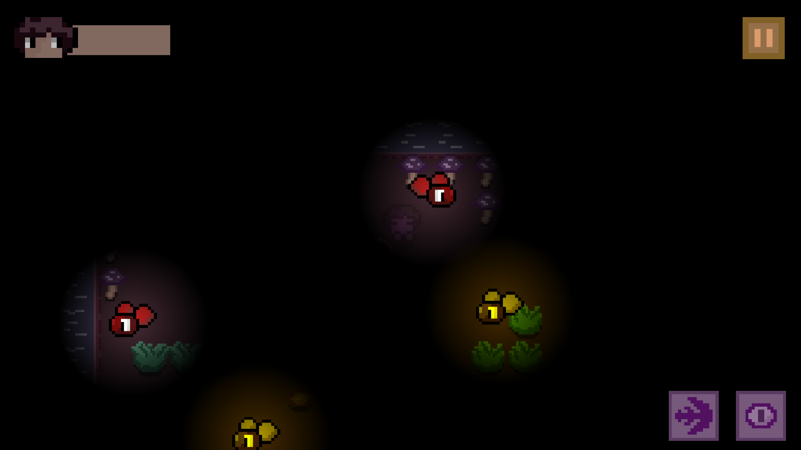

# 🕯️ Lantern Deep

Lantern Deep is a **top-down 2D stealth adventure** built in Unity, blending tight movement, reactive abilities, and moody atmosphere with an intimate, narrative-driven experience. Navigate dimly lit environments, avoid lurking dangers, and uncover story moments hidden between silence and shadow.
You are not meant to rush. You are meant to notice.

  
  
  
  

---

## 🌒 Premise
You descend into a quiet, enclosed world where every step matters. Armed with only a lantern and a handful of abilities, you must navigate hostile spaces, interact with strange NPCs, and survive long enough to piece together what lies beneath the surface.

Your task is simple: move forward, survive, and listen.

---

## 🕳️ World & Atmosphere

Lantern Deep takes place across a series of compact, hand-crafted levels featuring:

- 🕯️ Dimly lit environments where visibility is limited  
- 👤 NPC encounters that hint at a larger story  
- ⚠️ Environmental hazards that punish careless movement  
- 🌫️ A restrained, hand-drawn pixel-art style  
- 💬 Dialogue presented through a typing system with character portraits  

Each space is designed to feel enclosed, intentional, and uneasy.

---

## 🧠 Core Gameplay

- **Movement & Abilities**
  - Dash to reposition or escape danger  
  - Temporary invisibility to avoid threats  
  - Interaction with objects, NPCs, and level triggers  

- **Narrative Progression**
  - Dialogue-driven storytelling
  - Conversations advance with player input
  - Levels transition automatically once dialogue concludes

- **Player Feedback**
  - Visual and audio cues for all abilities
  - Responsive controls designed for keyboard play

---

## 🕹️ Controls

| Action            | Key |
|-------------------|-----|
| Move              | `W A S D` |
| Dash              | `Z` |
| Invisibility      | `X` |
| Interact          | `E` |
| Advance Dialogue  | `Space` |
| Pause Menu        | `Esc` |

Dialogue text types out gradually.  
Press `Space` again to instantly reveal the full line.

---

## 🎨 Assets & Audio

- **Visuals**  
  - All sprites and visual assets were created by me using **Aseprite**

- **Music & Sound**  
  - Original soundtrack composed by a music-engineer friend  
  - Typing and interaction sound effects handled through the AudioManager

Every asset was created specifically for this project to maintain a cohesive tone.

---

## 🧪 Built With

- Unity
- C#
- Unity UI System
- Custom dialogue and ability systems

---

## 🚀 How to Play

1. Clone the repository  
2. Run the executable  
3. Move carefully. Not everything wants to be seen.  
